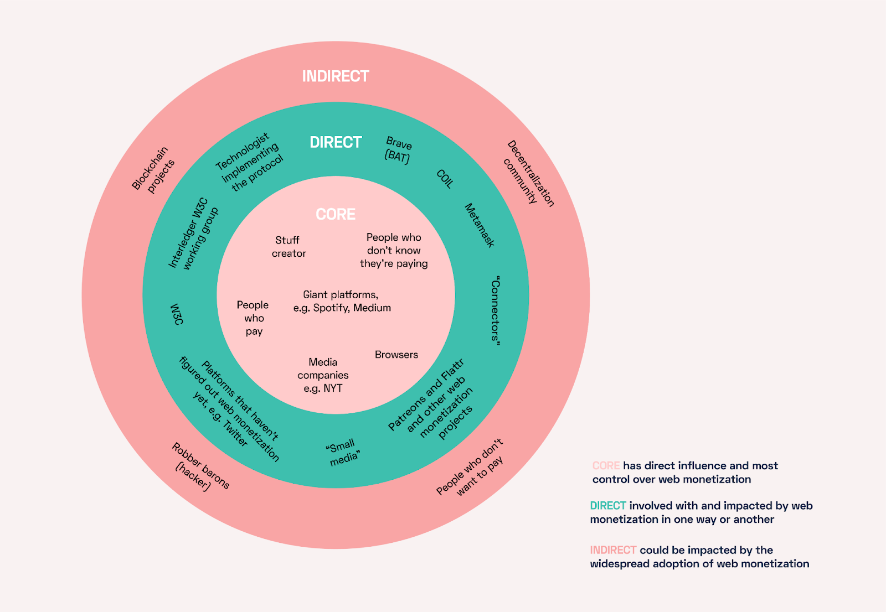
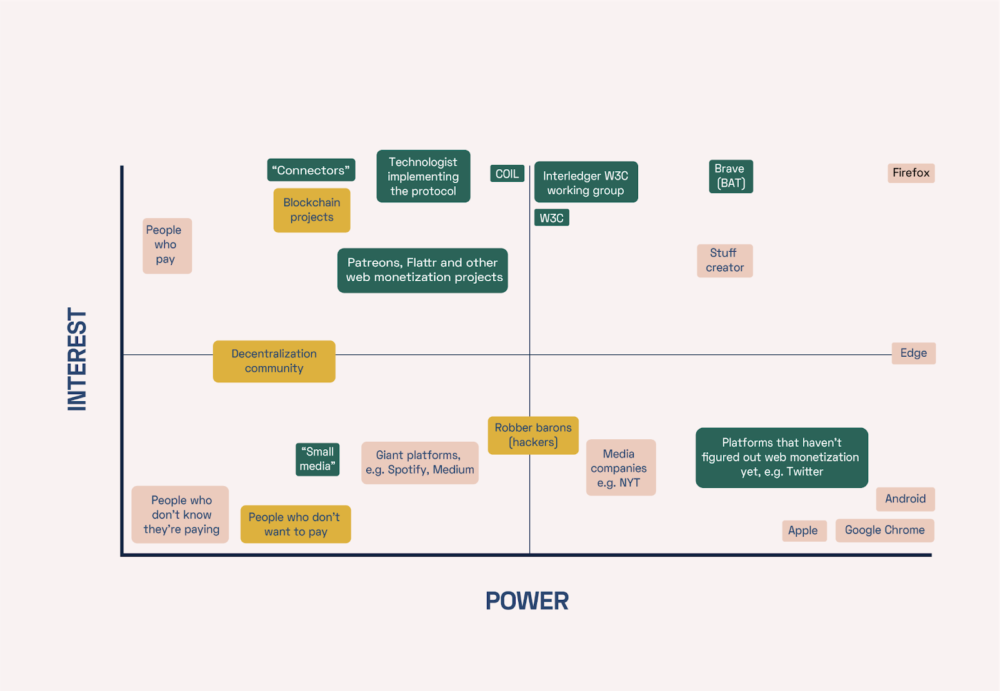
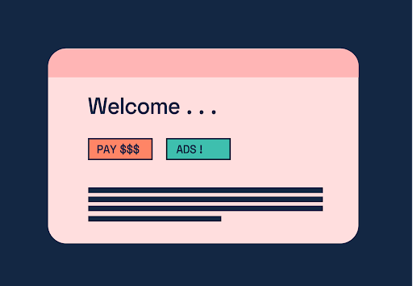
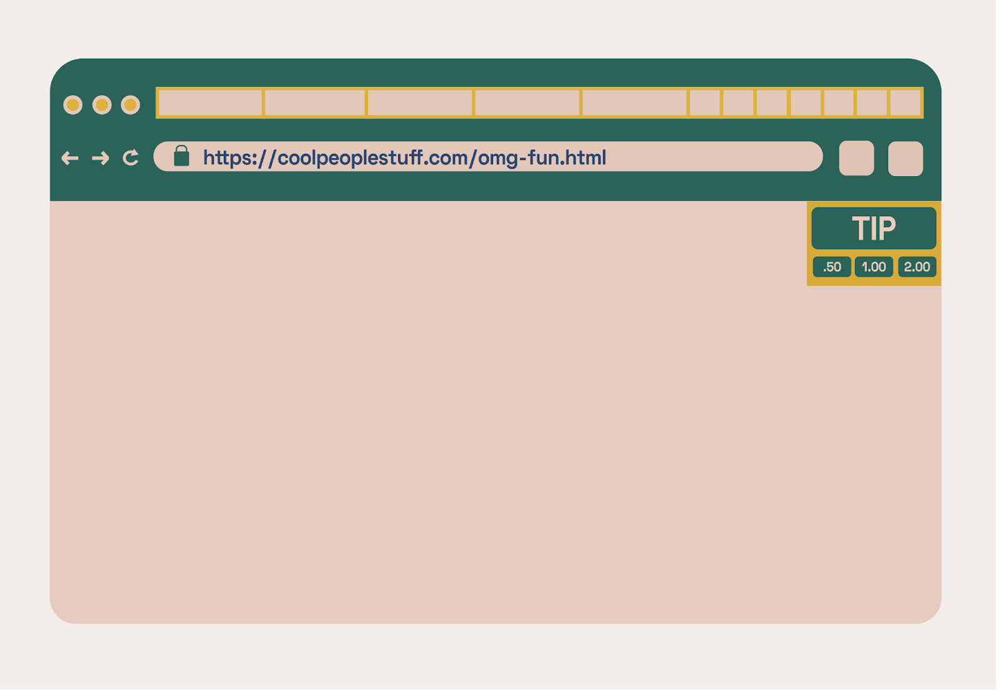
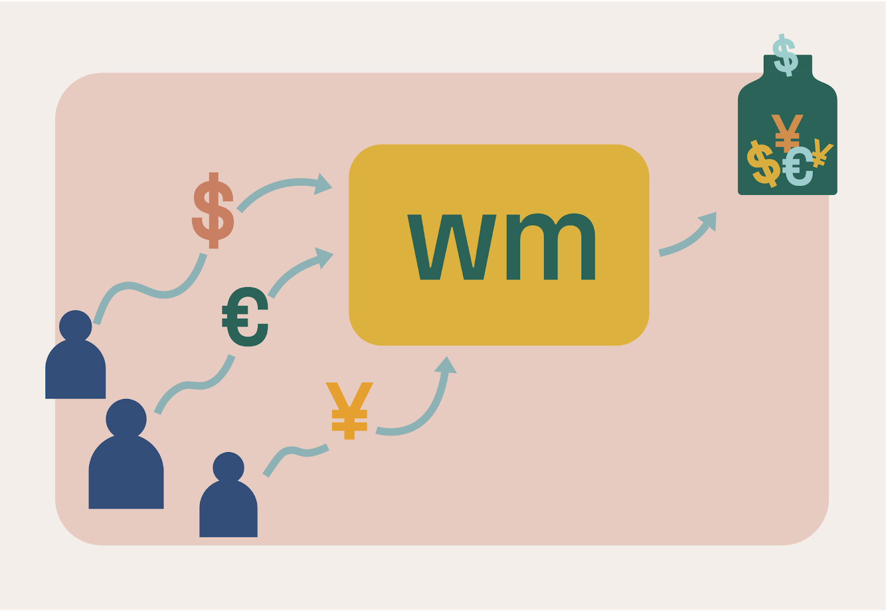
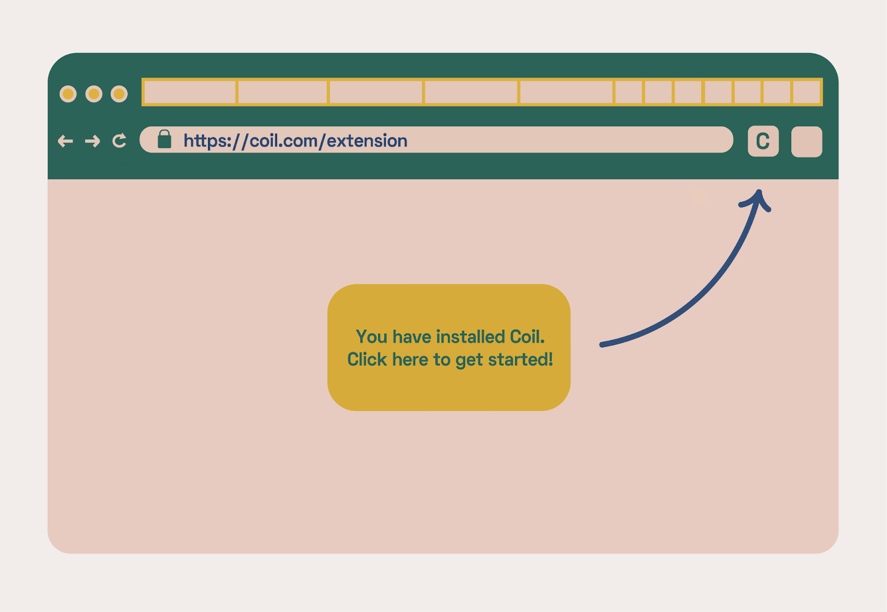

  <h1>Barriers to  Adoption for  Web Monetization</h1>

  
 
    Karissa McKelvey and Ngọc Triệu
   
    <a href="https://simplysecure.org">Simply Secure</a>
  

  
<i>With funding support from <a href="https://grantfortheweb.org">Grant for the Web</a></i>

The Web Monetization API has the potential to create an alternative to targeted
advertising. Yet despite this promising possibility, confusion and significant
barriers to adoption remain on behalf of both the sender and receiver of
payments. In response, this report and accompanying zine work first to
highlight common questions and challenges encountered by end users, and then
offer a set of recommendations for opportunities to expand web monetization
adoption in the future.

### Dear Decent, Money in my browser!?? 

*32 Questions I have about Web Monetization*

  <a class="link-reference" href="/zines/web-monetization">View full-sized in your browser</a>
   
  <a class="link-reference" href="/zines/web-monetization/decent-large.png">Download high-quality version</a>
   
  <iframe width="100%" height="600px" src="/zines/web-monetization"></iframe>

## Barriers to Adoption for Web Monetization

<a class="link-reference" href="/files/DOTS-webmon-report.txt">Open as a text file</a>

<a class="link-reference" href="/files/DOTS-webmon-report.txt">Download the PDF</a>

### Report Summary

Our research into the current barriers to adoption for the Web Monetization API revealed multiple opportunities to help expand adoption and mitigate end-user issues. If incorporated, the recommendations offered below would help reduce user confusion, increase transparency, and improve overall retention rates. The recommendations are organized by target user groups.

_Streaming platforms such as Coil should_:

*   **Enhance subscription transparency.** Provide real-time feedback in the streaming platform website (for creators) and in the web extension (for audience members). 
*   **Provide better wallet support.** Support a more diverse set of options and reduce dependency on a particular type of financial wallet platform. 
*   **Add creator-friendly documentation.** Provide step-by-step instructions, including screenshots, on how to start making money quickly with existing platforms (such as Patreon, YouTube, or Twitch).
*   **Include a web extension walkthrough.** Such a walkthrough could be displayed immediately after installation to help explain why and how the web extension is needed.
*   **Automate the sign-up process.** Implement a self-serve user interface with the ability for users to automatically enable OAuth and receive a developer key as part of a user interface.

_Creators who want to use Web Monetization should_:

*   **Add a payment pointer to their website.** After signing up, creators are provided with a payment pointer -- sometimes called a “Wallet URL” -- which is a series of numbers and letters unique to the creator. The creator should add this to the HTML of their website to start using Web Monetization.
*   **Provide an ad-free option.** Offer users a button that provides the option to “_Remove advertisements_” as either a banner ad or a blocking pop-up.
*   **Inform their audience.** Explain how to install the appropriate web extension or browser that supports web monetization by using a step-by-step process and links.

_Maintainers of the Web Monetization API and Interledger Protocol should_:

*   **Remember developers are users.** Mobile and desktop applications that support payee-payer relationships on their platforms could be potential early adoption partners if they are targeted and curated through better communication and transparency. 
*   **Design for built-in tipping.** Enable tipping directly in the web browser itself by presenting a button that would allow for a tip to be sent directly to the creator of the content currently on the page.
*   **Test recommended services.** Creating a process for monitoring the quality for any of the services linked to on the main [Web Monetization webpage](https://webmonetization.org/).

### Table of Contents

- [Project Overview](#1.-project-overview)
  - [Introduction](#1.1.-introduction)
  - [Research Objectives](#1.2.-research-objectives)
  - [Research Methodology](#1.3.-research-methodology)
  - [Who we are](#1.4.-who-we-are)
- [Understanding Web Monetization](#2.-understanding-web-monetization)
  - [Four Design Patterns](#2.1.-four-design-patterns)
  - [Case Studies](#2.2.-case-studies)
- [Challenges](#3.-challenges)
  - [User Journey](#3.1.-user-journey)
  - [Centralized Financial Services](#3.2.-centralized-financial-services)
  - [Mental Models](#3.3.-mental-models)
- [Recommendations](#4.-recommendations)
  - [For Streaming Platforms](#4.1.-for-streaming-platforms)
  - [For Creators](#4.2.-for-creators)
  - [For Maintainers](#4.3.-for-maintainers)
- [Conclusion](#5.-conclusion)
- [Acknowledgments](#6.-acknowledgments)

## 1.  Project Overview 

### 1.1. Introduction

Businesses routinely use algorithmic insights into who a potential customer might be, and what they might be interested in purchasing, to increase purported ad relevance. From a corporate perspective, this intrusive approach has been a runaway success. The surveillance of users and the subsequent monetization of their data has powered the dramatic rise of many of Silicon Valley’s most profitable companies. Yet from a human-centered design perspective, the process of personalized advertising has been toxic. Users no longer simply consume products on the web -- they have become the product.

Mass targeted advertising has also created a series of societal and safety issues, ranging from coordinated misinformation campaigns to invasive mobile pop-ups. Despite these and other persistent problems, many users have continued to tolerate the current ad-based structure of the internet in an un-bargained-for and unequal exchange to access purportedly “free” information. But as these extractive practices continue to expand their scope, and users across the globe continue to gain awareness of these issues, attention has begun to shift towards finding a new way forward. How can websites continue to get paid for web traffic without employing targeted advertising? 

The [Web Monetization API](https://webmonetization.org/) is a new standard that proposes a technical answer to this complicated question. In doing so, it offers a piece of technology that has up to this point been absent in web browsers: the ability for users to transfer miniscule amounts of money as an ad-free means to compensate websites and their creators. Still, for many users, much remains unknown about this innovative technology.

This project, supported by the [Grant for the Web](https://www.grantfortheweb.org/), seeks to address this gap in knowledge by creating a better understanding of the current obstacles to the widespread adoption of decentralized identity and web monetization. In doing so, extensive research was conducted to reveal an in-depth depiction of the existing ecosystem from the user’s perspective. This document identifies several opportunities for expanding the adoption of web monetization.

### 1.2. Research Objectives

Our expert research and design team came into this project with little understanding about the specifics of Web Monetization. Although this semi-outsider's perspective ultimately helped us see new user adoption pain points with fresh insight, it also meant that to begin we first needed to understand the ecosystem at a deeper level. Therefore, over the course of three months (November 2020 to February 2021) we carried out the following research objectives:

 

  *   **Learn more about design patterns** that already exist in the space; and
  *   **Understand security threats**, privacy threats, and other risks to end-users.
  *   **Recommend ways around the roadblocks** to adoption of decentralized identity and web monetization;

### 1.3. Research Methodology

Our research strategy was to first map the ecosystem of stakeholders, and then pinpoint key organizations with significant influence in the space. After completing this initial task, we chose to interview those who had already performed significant on-the-ground research themselves, in order to capture a high-level perspective of their various insights. This approach allowed us to leverage the deep-seated knowledge of these experts as we moved forward with our work. 

Next, we created a stakeholder map for Web Monetization as well as a slightly larger group more broadly defined -- including not only the existing Browser API, but also projects and products that are interested in or impacted by the monetization of websites. This important step allowed us to learn from various approaches in adjacent domains and apply lessons learned as we moved forward and prepared our analysis and recommendations. 

Core stakeholders (i.e., those who have the most direct influence and control over web monetization) include web browsers, large platforms, and media companies, as well as those who are creating and consuming content on the web. The [Brave](https://brave.com/) web browser (which has tested a new form of payment directly through the browser), and [MetaMask](https://metamask.io/) (a web extension that manages cryptocurrencies and interfaces payments with websites) were included as direct stakeholders in this exercise. 

After organizing the core, direct, and indirect stakeholders, we then mapped their relative interests against the power they have over the adoption of web monetization policies and practices. This methodology enabled us to better understand who we should focus on interviewing as part of our research process.

The final phase of qualitative research involved interviewing 12 stakeholders, ranging from web monetization experts to end-user creators with no knowledge of web monetization. We also conducted a workshop for eight designers and product managers with experience in web monetization, decentralized technologies, and web extensions. The workshop focused on challenges that designers face when creating usable decentralized technologies, and the gap between user and developer mental models. This gap is a key challenge to the growth and adoption of the Web Monetization API. 

### 1.4. Who We Are

[Karissa McKelvey](https://simplysecure.org/who-we-are/karissa.html) and [Ngọc Triệu](https://simplysecure.org/who-we-are/ngoc.html) are core team members of [Simply Secure](https://simplysecure.org/), an international team of experts in research, design, software development, and product management with an emphasis on privacy, security, transparency, and design ethics. Through additional support from a diverse set of advisors and partners, Simply Secure helps practitioners design technology that centers and protects vulnerable populations by providing capacity-building, open research support, and community convening. 

Karissa researches technical architecture design and its impact on usability, safety, and resilience. Her contributions to decentralized applications are relied on by at-risk users including human and environmental rights defenders, journalists, and civil society activists. Her background is in political sociology and data science. 

Ngọc sees design as an intervention to asymmetrical power relations. As a design researcher, she imagines the futures of the world through lenses such as decoloniality and decentralization. Ngọc is passionate about user advocacy, co-creation, and equal access to knowledge(s). Her background is in design management, history, and cultures. 

## 2.  Understanding Web Monetization

### 2.1. Four Design Patterns

There are four dominant design patterns for using web monetization today: (1) advertisement, (2) tips, (3) subscriptions, and (4) streaming. Each is discussed below.

**(1) Advertisement** is the traditional way to monetize a website. The benefits are considerable, as creators get a reasonable and stable expectation of payment over time and per pageview. As noted above, however, advertising today is typically invasive from both the user experience and privacy standpoints.

  * Design Pattern Recommendation: _In the future, we hope to see more websites offer a button that says “Remove advertisements” to enable Web Monetization. See more in the [recommendations section for creators](#4.2.-for-creators)._

**(2) Tips** are a common and effective method to solicit money in physical spaces. The tip jar concept is therefore one that many websites have incorporated into their practice by using a service that makes it easy for users to make a donation.

  * Design Pattern Recommendation: _In the future, we hope to see more browsers directly implementing tip buttons. See more in the [recommendations section for maintainers](#4.3.-for-maintainers)._

**(3) Subscriptions** allow creators to predict a stable amount of income per cycle (typically monthly). They also enable creators to benefit from a sustained creator-reader relationship, by which creators are better able to understand who their subscribers are and what their audience wants – which helps websites grow and retain their subscription bases. Notably, subscription relationships can flourish when audience members can have the interactions they expect. For example, some people may be less likely to create a subscription if they are forced to give up personal information or receive too many emails; while others may be less likely to renew a subscription if they feel disconnected from the creator.

  * Design Pattern Recommendation: _In the future, we hope to see subscriptions become easier to create as part of the Web Monetization API’s developer documentation. See more in the [recommendations section for maintainers](#4.3.-for-maintainers)._

**(4) Streaming** is a new method enabled by the Web Monetization API that allows small quantities of money to be sent to a creator according to how much a user watches or interacts with their website. However, most web browsers do not yet support streaming payments over the Web Monetization API, so in order to utilize streaming services users need to download a web extension or one of the browsers that supports it. Although this innovative space remains largely unexplored, certain prototypes do currently exist that experiment with the method. [Coil](https://coil.com/), for example, is a 5$/mo subscription service that gives a percentage of that subscription fee to creators based on the amount of time users spend on each website. Though this process is likely different from what creators expect from a typical subscription service (under which an agreement is made directly between the producer of the content and the consumer at a predictable rate), it likely creates new streams of revenue from previously untapped sources such as users who would prefer -- due to level of use or privacy preferences -- to not sign-up for a direct subscription. 

  *  Design Pattern Recommendation: _In the future, we hope to see streaming platforms become more transparent about how much money is given to creators. See more in the [recommendations section for streaming platforms](#4.1.-for-streaming-platforms)._

### 2.2. Case Studies

Our team interviewed five new users of the Web Monetization API and tracked the progress of two organizations that attempted to integrate the technology into their existing web applications. Their experiences are documented in the case studies below.

**Case Study #1: COMPOST**

[COMPOST](https://compost.digital)is a magazine working towards forming a cooperative. It is now sharing the bank account of its Open Collective fiscal host. In addition to the editorial team, their magazine consists of contributors who all get paid upfront for creative contributions, and participate in further revenue sharing decisions where they may claim a portion of the total. All of the contributors to the magazine have their own personal bank accounts. They wanted to use the Web Monetization API for two particular purposes.

*   **Crowdfunding**: “We wanted to use it to be able to track the real-time balance and feed it back to magazine readers, but access to the account balance doesn't exist -- there is no way to show collective or historical balance. That's something we'd expect.”
*   **Distribute payments to multiple creators from a single website**: “Ideally each creator, each writer would get their own payment pointer. Then the money would go directly to them.” However, they found it time consuming for every contributor to sign up for a payment pointer individually, so they just have one payment pointer for the entire magazine and then manage the distribution of that money manually.

**Takeaways:** Managing money with multiple contributors on a single website is still not entirely straightforward with the Web Monetization API. Doing so requires extra effort on behalf of an organization’s IT manager or accountant to properly distribute payment to all contributors. The suggested [probabilistic revenue sharing pattern](https://webmonetization.org/docs/probabilistic-rev-sharing/) requires all contributors to sign up for a payment pointer and have separate bank accounts through a KYC process. Associating each payment pointer to a different bank/payment account isn't easy, and systems for invoice payout isn't in place. This approach is even yet more difficult to achieve when working with contributors of many different skill levels, time commitments, and abilities. Ideally in the future, Uphold will allow organizations to easily create and manage payment pointers, bank accounts, and invoicing.

**Case Study #2: Streetmix**

[Streetmix](https://streetmix.net/) is a collaborative civic engagement platform for urban design. They are developing a two-tiered freemium model, through which users can pay money to access premium features. Patreon is their target payment platform, but the team also wanted to integrate the Web Monetization API as an alternative way for users to pay for subscriptions. The Streetmix team encountered two main challenges in doing so:

* **Fixed subscription rates.** “Can we change the default rate people pay for a subscription? We haven't figured that out. Streetmix's model is not about being trapped in your site as long as possible.” The organization would benefit from a tutorial that provides guidance on how to ask users for a flat rate per month for access to premium content, rather per-visit payments.
* **Technical mental models.** “We figured that requiring a browser extension wouldn’t work for Streetmix users. If they have a Coil account they can set up a street mix account and connect them. But it's been a struggle to integrate. Developer friendliness is a more pragmatic priority. In our brains we haven't separated Coil and the protocol itself.” 

**Takeaways:** The Streetmix team would appreciate more developer-facing tutorials on how to integrate their platform with Web Monetization. They experienced confusion around the difference between the Interledger Protocol, Web Monetization API, and Coil. These difficulties could be an indication that the provided [introductory materials](https://webmonetization.org/docs) were unclear regarding which level of abstraction developers should be working with. Going forward, developers would benefit from the creation of an introductory checklist that offers insight into when they should, or should not, use an intermediary such as Coil in their platform.

## 3.  Challenges 

Overall, our research revealed that web monetization is still in an early innovation phase with significant barriers to adoption ahead. Although the ultimate goal of the process is for the end user is to pay the creator, and for the creator to get paid, we found numerous hurdles to accomplishing this goal for either group. These include the unknowns of the user journey, the in-depth identification requirements and variance of centralized financial services, and the incorporation of new mental models.

### 3.1. User Journey

Based on our research, we mapped out five key points for both creators (payees) and the audience (payers) in the user journey towards web monetization adoption. A conversion funnel for Web Monetization shows the rate at which users (i.e., a payee or payer) complete each step of the journey. The conversion rate for onboarding to the Web Monetization API could be monitored by the flagship products that are invested in the success of the technology. Below, we’ve listed key questions that should be readily answered while users are attempting to integrate the technology.

1. _Understand why._ A user first needs to understand why they should invest their time (and ultimately money) into web monetization. In particular, a creator needs to understand why they should spend time signing up, and how doing so could impact their audience and economic return. Relevant questions include:

  1. How much money does a creator expect to receive over time?
  2. How does it benefit me (or my users?)
  3. How does it compare to other payment methods?
  4. How easy will it be to correctly report my income for tax purposes?

2. _Create a wallet._ Once a user understands why they want to use web monetization, they next need to go through the process of creating a wallet. Most users will create a wallet on centralized services such as [Uphold](https://wallet.uphold.com/signup), as this is the [recommended method](https://webmonetization.org/docs/uphold/) on the Web Monetization website. At this point, relevant user questions include:

  5. What happens if I lose my password?
  6. Can I manage my own decentralized wallet (on a phone, laptop, web extension or all of the above)?
  7. How can I manage payment pointers for users of my platform?

3. _Enable web monetization._ To use web monetization, two sides of the relationship must be established: (1) the creator needs to integrate the payment pointer into their website, and (2) the reader needs to have a web monetization-enabled browser or web extension. For first-time users, this will involve installing and running the appropriate software, knowing how to finish the onboarding process, and then connecting their newly created wallet. In doing so, questions may include:

  8. How will the user experience change if web monetization is enabled?
  9. Will enabling web monetization slow down my website?

4. _Make a payment._ Once web monetization is enabled and a wallet is connected to the browser, the user will be able to send payments. The browser only allows allocation of payments with the amount and the intended recipient (also called a payment pointer).

  10. How much am I paying?
  11. When do I pay?
  12. How can I pay more or less?
  13. How can I refund a payment?

5. _Retention and sustainability._ Upon completion of the prior four steps, a user’s concern turns toward the future. For web monetization adoption to increase (and for existing users to be retained and sustained), users must have a general understanding of what using web monetization looks like long term. Unfortunately, however, we found a significant lack of attention to this detail in the existing ecosystem. It is not easy for users to find answer to important questions such as:

  14. How much money will a creator expect to receive over time?
  15. How much of my money is going to be spent at which websites?
  16. Is this worth my money, or should I allocate my resources in a different way (i.e., a subscription to the creator)?
  17. How can I further engage and retain my audience?

### 3.2. Centralized Financial Services

The designers and experts we interviewed as part of our research process
identified onboarding as the single most challenging obstacle for web
monetization adoption. Creators who want to collect money using Web
Monetization must sign up for an account with an approved financial services
company (at the time of research, two companies were available:
[Uphold](https://uphold.com/en-us) and [GateHub](https://gatehub.net/)).
Similar to PayPal, services like Uphold broker payments and allow users to
exchange between tokens and currencies. 

To deposit or withdraw money, users are required to provide verification of
their identity to the financial service. This includes an operational email and
phone number, as well as a photo of themselves and an identification document
such as a passport. These requirements are part of an industry standard
practice called KYC (Know your Customer), which has been implemented with the
goal of reducing fraud and abuse in these areas. Though important, this process
nonetheless introduces a significant number of hurdles for creators to get
their Web Monetization identification number and start collecting money from
their audience members.

Interestingly, we observed that the user experience between Uphold and GateHub
varied significantly enough that specialized tutorials and training may be
needed for each platform. This suggests that the widespread adoption of the Web
Monetization API is at least partially dependent upon the capabilities of these
third-party companies and their human-centered design practices. This level of
responsibility -- which is largely beyond the control of the API -- is
important to acknowledge as the maintenance of these services is subject to
instability over time. 

### 3.3. Mental Models

A mental model is an explanation or representation of an individual's thought process about how something works, which simplifies a complex topic into a more intuitive understanding. We found four key concepts that require users to create new mental models to use the Web Monetization API: web extensions, wallets, account recovery, and streaming.

**_Web Extensions_**. It is often unclear to users why downloading a web extension is necessary. In response, web browsers such as Brave and Puma removed this extra step by integrating the underlying technology directly into the browser itself. Although this improves adoption, one participant noted there is “skepticism that laggard browsers will adopt the right crypto support, especially on mobile.” If the Web Monetization API is to become more accessible, it needs support to be more directly integrated in popular browsers such as Firefox.

**_Wallets._** A wallet is a service that stores the public and/or private keys for cryptocurrency transactions. The concept of a “wallet” is common in adjacent and related products. For example, the Brave Browser has a feature which allows users to tip websites from a wallet that is integrated into their browser as a web extension. Nonetheless, as discussed above, creating a wallet is often a new experience (and potential obstacle) for many users. Users who are familiar with cryptocurrency may expect to be able to connect an existing browser wallet such as MetaMask, but that is also not directly possible with the Web Monetization API at this time.

**_Account recovery._** If you lose your password to a typical centralized account, the service provider can help you gain access anyway with identity verification methods, such as a phone number. As a participant noted, however, “if you lose the keys to your [decentralized] wallet, there isn't an analogue for a locksmith.” This limitation creates a tension between security and usability.

**_Streaming_**. Web Monetization allows streaming payments to be made through a browser via small incremental payments made over time. This breakthrough technology is not possible in traditional banking relationships. Such innovation, however, can be a hurdle for users seeking to understand when and how money is being sent and received. To better communicate these processes, Web Monetization-enabled web extensions should give users direct feedback about how much money they are sending to a website in real time. A major goal should be to prevent a situation in which a user is unaware that they are giving money to a website.  

## 4.  Recommendations

Our research revealed a myriad of opportunities that can help expand web monetization adoption. To summarize, we've organized these recommendations into three target groups. To get the most of out of this section, take a moment to recognize what user group you fall into. If you are:

  - [4.1. For Streaming Platforms](#4.1.-for-streaming-platforms) is for people who are part of an organization such as Coil, that provides an aggregation or streaming service using the Web Monetization API.
  - [4.2. For Creators](#4.2.-for-creators) is for people part of a small group or an independent creator looking for other forms of fundraising, look at the "For Creators" section. 
  - [4.3. For Maintainers](#4.3.-for-maintainers) is for people interested in implementing, maintaining, or contributing to the Web Monetization API and surrounding documentation.

### 4.1. For Streaming Platforms

**_Enhance subscription transparency_**

In this report’s user journey section and the accompanying zine, we outlined several of the many unanswered questions that creators and audience members routinely have when setting up an account with a service such as Coil. These questions include:

  1. How much am I paying?
  2. When do I pay?
  3. How can I pay more or less? 
  4. How can I refund a payment? 
  5. How much money will a creator expect to receive over time? 
  6. How much of my money is going to be spent at which websites? 
  7. How can I further engage and retain my audience?

Given the amount and frequency of these questions, streaming platforms should work to improve transparency in the web extension and on the creator’s profile. In doing so, platforms should provide real-time feedback in the streaming platform website (for creators) and in the web extension (for audience members). These changes would help improve trust in the service as well as the Web Monetization API.

As noted above in section 3.3. (Mental Models), streaming is a new technology that requires new mental models. Providing real-time tactile feedback can help improve understanding and allows users to feel in control, take appropriate actions to reach their goal, and ultimately trust the brand ([NNGroup](https://www.nngroup.com/articles/visibility-system-status/)). Web Monetization-enabled web extensions should therefore give users direct feedback about how much money they are sending to a website in real time.

**_Provide better wallet support_**

As noted in section 3.3 (Mental Models), a “wallet” is another new technology that requires new mental models on the behalf of creators. All streaming platforms currently require creators to integrate with a wallet platform such as Uphold or GateHub before collecting money. This required step, however, is not always easy for new users to accomplish. The KYC (“Know Your Customer”) process can be difficult and time-consuming to complete, and requires giving up a significant amount of personal information to a third-party platform. Many creators do not want to maintain multiple online accounts to receive and manage their money, and many users may reasonably expect to be able to connect an existing wallet hosted with a popular financial platform like Paypal, Square, or MetaMask -- but this option is not available in the currently available Web Monetization services.

Streaming platforms should therefore work to support a more diverse set of options and reduce dependency on a particular type of financial wallet platform, or even integrate the KYC process directly. This efficiency-enhancing change would improve adoption drastically, especially with creators that are busy or already make an income online, and could be achievable through a direct partnership with financial companies.

**_Add creator-friendly documentation_**

Many of the existing explanatory resources about Web Monetization are targeted towards end users or developers, resulting in a lack of information explaining how to integrate the technology into existing creative platforms where creators are already making money. This knowledge gap could be addressed by the formulation of creator-friendly documentation that provides step-by-step instructions, including screenshots, on how to start making money quickly with existing platforms (such as Patreon, YouTube, or Twitch).

**_Include a web extension walkthrough_**

All web extensions need thorough in-app walkthroughs to orient users on how to best use the service. Providing a web extension walkthrough would help clarify certain existing points of confusion, such as the fact that the web extension is primarily targeted at audience members -- not creators. This walkthrough could be displayed immediately after installation to help explain why and how the web extension is needed.

**_Automate the sign-up process_**

Coil users currently looking to integrate their application through the OAuth API are required to go through an ad-hoc and manual process. In the future, mature implementations of API would ideally have a self-serve user interface, with the ability to automatically enable OAuth and get a developer key as part of a user interface. Implementing this recommendation has the power to change a weeks or months-long process into mere hours or at most days. There should also be better documentation online for when and how (including when _not _to) use the OAuth API.

### 4.2. For Creators

**_Add a payment pointer to your website_**

The most straightforward way for creators to start collecting money immediately is to add a payment pointer to their content. After signing up for Uphold or Gatehub, creators are provided with a payment pointer -- sometimes called a “Wallet URL” -- which is a series of numbers and letters unique to the creator. By adding this payment pointer to the HTML of their website, a creator can start collecting money from users. For creators collecting money through an existing platform such as YouTube or Twitch, payment can be enabled by adding the payment pointer to the profile page within a streaming platform such as Coil.

**_Provide an ad-free option_**

Creators should consider offering users a button that provides the option to “_Remove advertisements_” as either a banner ad or a blocking pop-up. After entering the website and clicking the “_Remove advertisements_” button, users would then be sent to a screen explaining how to install the appropriate web extension or browser that supports web monetization. Upon installation, users should be redirected to return to the page they were attempting to view and begin the ad-free experience. An example of how to integrate this technically is available in Web Monetization’s official [Getting Started documentation](https://webmonetization.org/docs/getting-started/).

**_Inform your audience_**

Creators who decide to adopt the Web Monetization API should inform their users that they must download a web extension or browser to properly enable it. This essential information can be conveyed to users by providing a series of how-to steps once a user has decided to opt-in to pay.

For example, here is an [excerpt from COMPOST digital’s instructions](https://one.compost.digital/support-us/#web-monetization):

 

  1. Visit [Coil](https://coil.com/signup) and signup.
  2. Go to Settings and enter the "Membership" menu item.
  3. Add your credit card and subscribe. It's $5 a month.
  4. Download the extension for any browser of your choice.

### 4.3. For Maintainers

**_Remember developers are users_**

An important target user base for Web Monetization is developers who want to integrate web monetization into their platforms or applications. Yet because Web Monetization and the Interledger Protocol have not yet been adopted by mainstream browsers, the user base is currently limited to those products that already incorporate these technologies. Going forward, mobile and desktop applications that support payee-payer relationships on their platforms could be potential early adoption partners if they are targeted and curated through better communication and transparency. 

**_Design for built-in tipping_**

For the Web Monetization API to become more accessible, it needs support to be more directly integrated in popular browsers. As part of this integration process, browsers could use the Web Monetization API to enable tipping directly in the web browser itself by presenting a button that would allow for a tip to be sent directly to the creator of the content currently on the page. This would help expand the tool’s reach and the creator’s options to receive payment. Notably, Brave Browser has a[ product](https://brave.com/tips/) like this that users can try today (although not very many websites currently support Brave tips at this time). 

**_Test recommended services_**

During our research, we found that users had significant challenges signing up for GateHub accounts due, potentially in part, to a lack of quality assurance. The maintainers of the Web Monetization main website could help address this problem by creating a process for monitoring the quality for any of the services linked on the main webpage. Services that are unable to complete usability tests at a high standard should not be included as recommended services.

## 5.  Conclusion

Overall, our research shows that the Web Monetization API retains real interest and momentum throughout the community. The innovative tool has the potential to supplement (although not replace) advertising as a means for accessing content and paying creators on the web. In situations where this transition occurs, individual autonomy and agency will be strengthened as users -- not large corporations -- will be able to set their own privacy and payment preferences. Website developers will also benefit through an additional option by which they can monetize their content without relying on invasive surveillance practices. Yet despite this promising potential, significant barriers to adoption remain on behalf of both the sender and receiver of payments. Significant confusion also continues to surround the various contexts in which the Web Monetization API should or _should not_ be used. With time, however, it is our hope that these issues will be addressed through improved documentation, quality control, and increased buy-in from major browsers. The recommendations for end-user applications planning to adopt the Web Monetization API and Interledger Protocol offered in this report are intended to be a first step in this important process.

### 6. Acknowledgments

Thanks to [Grant for the Web](https://www.grantfortheweb.org/) and [Simply Secure](https://simplysecure.org) a for financial and organizational support of this project. Our gratitude also goes out to all workshop participants and interviewees for sharing their expert analysis, insight, and experience.

